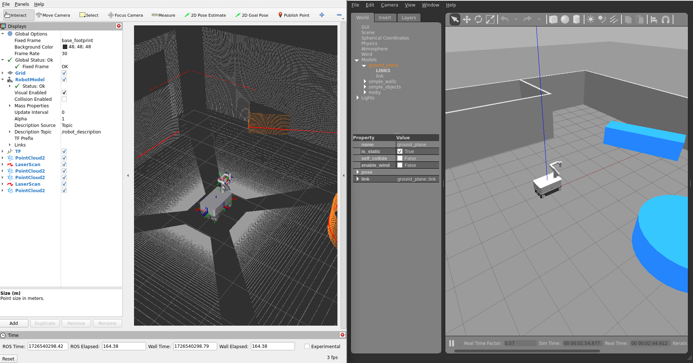
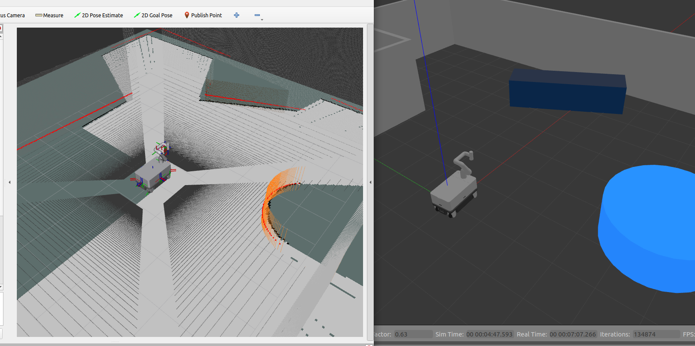
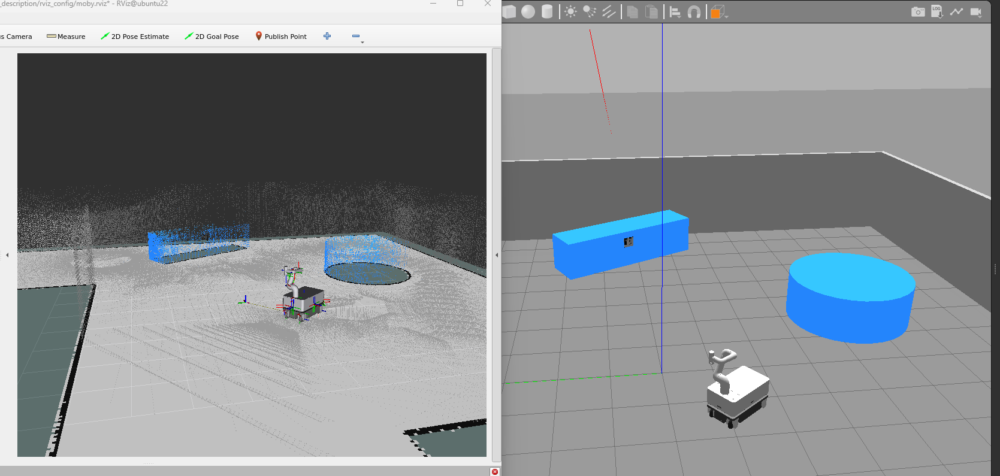
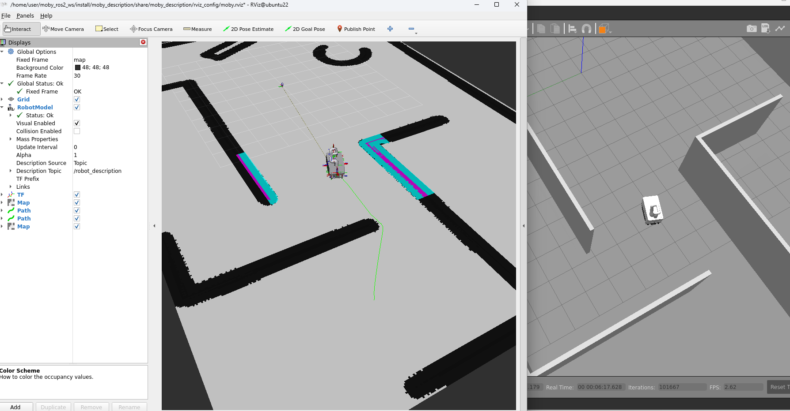

# MOBY ROS2 HUMBLE

## Installation
### Supported OS (2023.01.08)
* Ubuntu 22.04
* ROS2 Humble
* Python 3.10

### BIOS Setting (NUC)
* Connect monitor, keyboard and mouse to NUC and reboot, press F2 to enter BIOS Setup 
* **Boot** > **Secure boot** > **Secure boot** > **Disabled**
* **Power** > **Secondary Power Settings** > **After Power Failure** > **Power On**
* **Advanced** > **Onboard Devices** > **Bluetooth** > *Uncheck*
* Press **F10** to Save and Exit

### Basic Setup
* Install basic tools (make sure sudo apt-get update finishes w/o any error)
```bash
sudo apt-get update \
&& sudo apt-get install -y git openssh-server net-tools \
&& sudo apt-get install -y python3-pip \
&& sudo pip3 install --upgrade pip \
&& sudo pip3 install setuptools \
&& pip3 install --upgrade setuptools \
&& sudo apt install protobuf-compiler=3.12.4-1ubuntu7 \
&& python3 -m pip install protobuf==3.19.4 grpcio==1.48.2 grpcio_tools==1.48.2 \
&& sudo apt-get install jupyter
```

* Disable kernel update (kernel updates sometimes break some package functions)
```bash
sudo apt-mark hold linux-image-generic linux-headers-generic
```

### Install ROS2 HUMBLE

The following software needs to be installed:
- [ROS2 Humble](https://docs.ros.org/en/humble/Installation.html)
- [Neuromeka Package](https://github.com/neuromeka-robotics/neuromeka-package)
    ```
    pip3 install neuromeka
    pip3 install --upgrade neuromeka
    ```

#### Install ROS2 HUMBLE dependent packages
```bash
sudo apt install -y ros-humble-perception-pcl \
                    ros-humble-cartographer* \
                    ros-humble-xacro  \
                    ros-humble-ros2-control  \
                    ros-humble-ros2-controllers  \
                    ros-humble-controller-manager  \
                    ros-humble-joint-state-broadcaster \
                    ros-humble-joint-state-publisher-gui \
                    ros-humble-navigation2 \
                    ros-humble-nav2* \
                    ros-humble-geographic-msgs \
                    ros-humble-robot-localization \
                    ros-humble-joy-linux \
                    ros-humble-libg2o \
                    ros-humble-slam-toolbox \
                    ros-humble-ros-ign \
                    ros-humble-ros-ign-gazebo \
                    ros-humble-ign-ros2-control \
                    ros-humble-ros-ign-interfaces \
                    ros-humble-gazebo-ros-pkgs \
                    ros-humble-tf-transformations \
                    ros-humble-teleop-twist-keyboard \
                    ros-humble-rtabmap-ros \
                    ros-humble-octomap-ros \
                    ros-humble-octomap-rviz-plugins \
                    ros-humble-nav2-map-server \
                    ros-humble-sick-scan-xd \
                    ros-humble-librealsense2* \
                    ros-humble-realsense2-camera \
                    ros-humble-realsense2-description

&& sudo apt install -y python3-colcon-common-extensions \
&& sudo apt install python3-rosdep -y \
&& sudo apt install python3-rosdep2 -y \
&& sudo rosdep init
```

#### source workspace
```bash
source /opt/ros/humble/setup.bash
echo 'source /opt/ros/humble/setup.bash' >> ~/.bashrc
```

### Build Moby Source
* Create workspace
```
mkdir -p ~/ros2_ws/src
cd ~/ros2_ws/src
git clone <this repository url>
```

* Build the source code

```
cd ~/ros2_ws/
colcon build
```

* Source setup file
```bash
. install/setup.bash
echo 'source $HOME/ros2_ws/install/setup.bash' >> ~/.bashrc
```

## Usage

### NOTE

- Moby behavior: define Moby behavior
- Moby description: define Moby model
- Moby bringup: connect to Moby GRPC server
- Moby mapping: mapping using cartographer or slam toolbox
- Moby navigation: navigation with Moby
- Moby gazebo: gazebo simulation for Moby

Use **moby_type** to choose specific robot **(moby_rp, moby_rp_v3)**.\
If not specified, the default value will be moby_rp.

### Robot Description

To start robot description
```bash
ros2 launch moby_description moby_display.launch.py moby_type:=moby_rp
```

### Simulation Robot

Use **world_file** to choose specific world file.\
If not specified, the default value will be example.

#### Start Simulation Robot

```bash
ros2 launch moby_gazebo moby_gazebo.launch.py world_file:=example moby_type:=moby_rp
```




#### To Start Mapping

* Slam toolbox
```bash
ros2 launch moby_mapping slam_toolbox.launch.py use_sim_time:=true
```


* Cartographer 2D

```bash
ros2 launch moby_mapping cartographer_2d.launch.py use_sim_time:=true launch_rviz:=false
```

* Cartographer 3D
```bash
ros2 launch moby_mapping cartographer_3d.launch.py use_sim_time:=true launch_rviz:=false
```




#### To Start Navigation

```bash
ros2 launch moby_navigation navigation2.launch.py use_sim_time:=true launch_rviz:=false
```



### Real Robot

#### Moby Setting
- Change the Moby config in ```moby-ros2/moby_bringup/param/moby_config.yaml```
* Moby Type
  - Robot type [moby_rp, moby_agri]
* Step IP
  - Ip address of STEP PC
* Sick IP
  - Connect Windows Computer (with Sopas ET installed) to the router.
  - Open Sopas ET and scan devices
  - Change IP address of the TIM lidars
    - front: 192.168.214.10
    - rear: 192.168.214.11
* Realsense
  - Open ```realsense-viewer``` from NUC
  - Check serial numbers for each camera
  - Change serial numbers in config file

#### To Start Control Moby
```bash
ros2 launch moby_bringup moby_bringup.launch.py
```

#### To Start Mapping

- Connect to the controller
  - Press **X + Home** button to connect controller to Moby (red led ON)
  - When the controller connected
    - To move: Press **L2 + Left joystick** for moving (non-holonomic)
    - To move: Press **L2 + Right joystick** for moving (holonomic)
    - To change speed: Press **R, R2** to change speed. Maximum 0.8 m/s (linear), 0.8 rad/s (angular)

- Using Cartographer
```bash
ros2 launch moby_bringup moby_bringup.launch.py
ros2 launch moby_mapping cartographer_2d.launch.py
```
- Using Slam Toolbox
```bash
ros2 launch moby_bringup moby_bringup.launch.py
ros2 launch moby_mapping slam_toolbox.launch.py
```

- To see the Map
  - On Rviz press Add (Near bottom left) => Choose Map
- To save the Map
```bash
ros2 run nav2_map_server map_saver_cli -f ~/<map_name>
```

- Easy map application - save as <map_name> = default_map and copy to working directory as below
```bash
mkdir ~/map_bak
mv ~/default_map.* ~/map_bak
ros2 run nav2_map_server map_saver_cli -f ~/default_map \
&& cp ~/default_map.* ~/ros2_ws/install/moby_navigation/share/moby_navigation/map/ \
&& cp ~/default_map.* ~/ros2_ws/src/moby-ros2/moby_navigation/map/
```

#### To Start Navigation

- Change the map before navigation
  - Copy map file to **moby_navigation/map** (2 files .pgm and .yaml)
  - Modify yaml file: Change the path link to pgm file to: **image: <map_name.pgm>**
  - In folder **moby_navigation/launch** modify **navigation2.launch.py** change map file in **map_dir** variable (line 30).
```bash
ros2 launch moby_bringup moby_bringup.launch.py
ros2 launch moby_navigation navigation2.launch.py
```
- Can tuning navigation parameter in **moby_navigation/param** folder.


#### Pairing PG-9023S with External Bluetooth Dongle
* [Prerequisite] Disable onboard bluetooth as described in BIOS Setting section
* After boot, Login and Open Bluetooth setting
* Push and hold **HOME + X** on *PG-9023S* until SEARCH LED blinks rapidly
* Find *PG-9023S* on the bluetooth device list and connect.
